# Wazuh SOC Home Lab

## 1. Introduction

### 1.1 Overview

This project documents the build of a home Security Operations Center (SOC) lab using **Wazuh**, an open-source SIEM and XDR platform. A Wazuh manager was deployed to collect and correlate telemetry from a Windows endpoint and an Ubuntu endpoint, each instrumented with **Sysmon** for deep system event visibility. The lab covers the full detection pipeline: log ingestion, agent deployment, activity generation, custom detection rules, file integrity monitoring, security dashboards, and automated active response to block malicious behavior.

### 1.2 Purpose and Goals

- **Stand up a central SIEM:** Deploy a Wazuh manager and enable full telemetry archiving.
- **Onboard endpoints:** Connect a Windows VM and an Ubuntu VM as monitored agents.
- **Add deep visibility:** Install and configure Sysmon on both endpoints for detailed process, network, and file event logging.
- **Generate and detect real activity:** Simulate account changes, failed logins, and brute-force attempts, then confirm they surface as alerts in Wazuh.
- **Monitor file integrity:** Track file creation, modification, and deletion on both endpoints in near real time.
- **Build custom detections:** Write custom Wazuh rules for scenarios not covered by the default ruleset (e.g. Guest account enabled).
- **Automate response:** Configure Active Response to automatically block a source IP after repeated failed SSH logins.
- **Visualize the data:** Build a security dashboard summarizing failed logons, account changes, and SSH authentication activity.

## 2. Prerequisites

### 2.1 Hardware Requirements

- Host machine capable of running a Wazuh server plus two endpoint VMs simultaneously.
- At least 2–4 GB RAM and 50 GB disk per VM.

### 2.2 Software Requirements

- **A hypervisor** — VMware or VirtualBox.
- **Wazuh 4.14** — SIEM manager, indexer, and dashboard (installed via the all-in-one script).
- **Windows VM** — monitored endpoint running the Wazuh agent and Sysmon.
- **Ubuntu Server VM** — monitored endpoint running the Wazuh agent and Sysmon for Linux.
- **Sysmon / Sysmon for Linux** — extended system event logging on both endpoints.

### 2.3 Prior Knowledge

- Comfort with the Linux command line and a text editor such as `nano`.
- Basic Windows administration (Services, Event Viewer, Local Users and Groups).
- Foundational understanding of SIEM concepts: log sources, correlation rules, and alerting.

## 3. Deploying the Wazuh Server

### 3.1 Install Wazuh (All-in-One)

On the server VM, Wazuh manager, indexer, and dashboard are installed with the official all-in-one script:

```bash
curl -sO https://packages.wazuh.com/4.14/wazuh-install.sh && sudo bash ./wazuh-install.sh -a
```

Full reference: [Wazuh Quickstart Guide](https://documentation.wazuh.com/current/quickstart.html)


The installer prints the initial `admin` password for the dashboard at the end of the run:

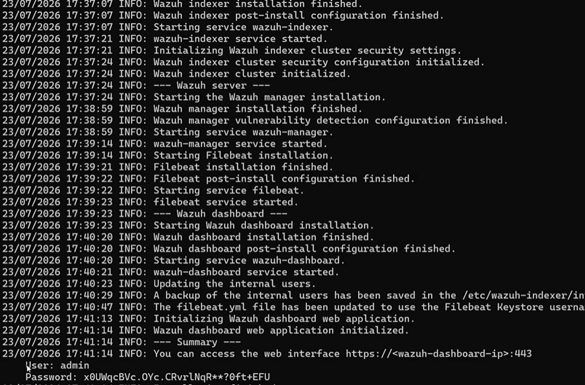

### 3.2 First Login

Browse to the dashboard URL and log in with the generated credentials (the password should be changed on first login):

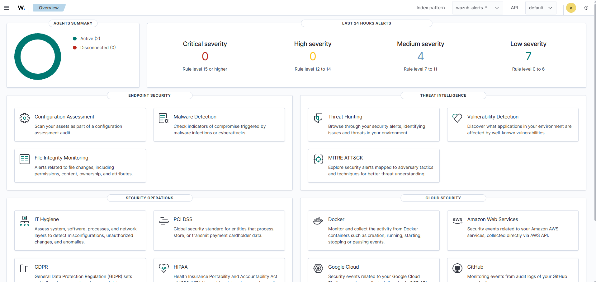

## 4. Enabling Full Telemetry (Archives)

By default, Wazuh only indexes alerts, not every raw event. To capture and monitor **all** telemetry (not just alerts), archiving is enabled.

### 4.1 Enable Archives in `ossec.conf`

```bash
sudo find / -name ossec.conf
sudo nano /var/ossec/etc/ossec.conf
```


Under `<ossec_config>`, set both values to `yes`:

```xml
<logall>yes</logall>
<logall_json>yes</logall_json>
```

Save with `Ctrl+X`, `Y`, `Enter`, then restart the manager:

```bash
sudo systemctl restart wazuh-manager
```

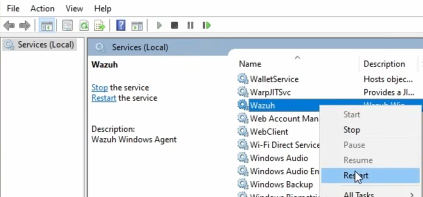

### 4.2 Enable Archives in Filebeat

Filebeat also needs archive shipping enabled — locate the archives block in the Filebeat config and switch it from disabled to enabled:

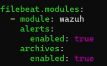

Restart Filebeat to apply the change:

```bash
sudo systemctl restart filebeat
```

### 4.3 Verify the Archives Index

Confirm the `wazuh-archives-*` index now exists and create an index pattern for it in the dashboard so raw events are searchable under **Discover**:

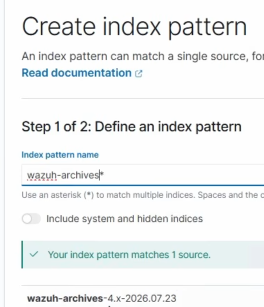
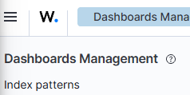
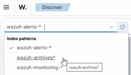

## 5. Deploying Endpoint Agents

Two endpoint VMs are created (Windows and Ubuntu), each on a NAT network with 2–4 GB RAM and 50 GB disk.

### 5.1 Deploy a New Agent

From the Wazuh dashboard, **Agents management > Deploy new agent** provides the manager IP and a ready-made install command for each OS:

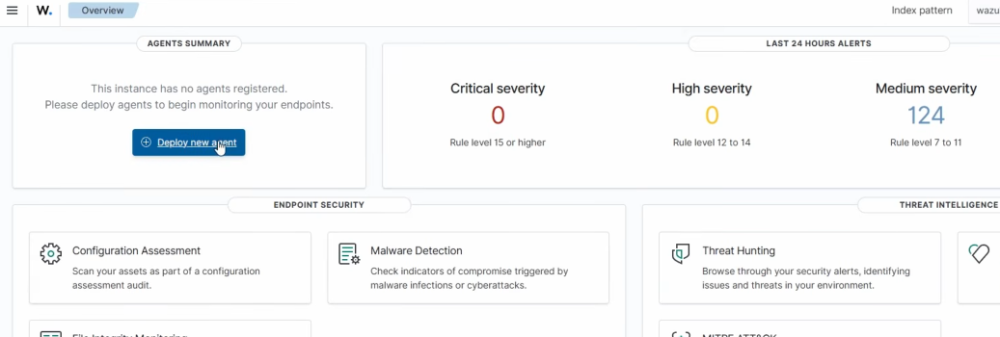
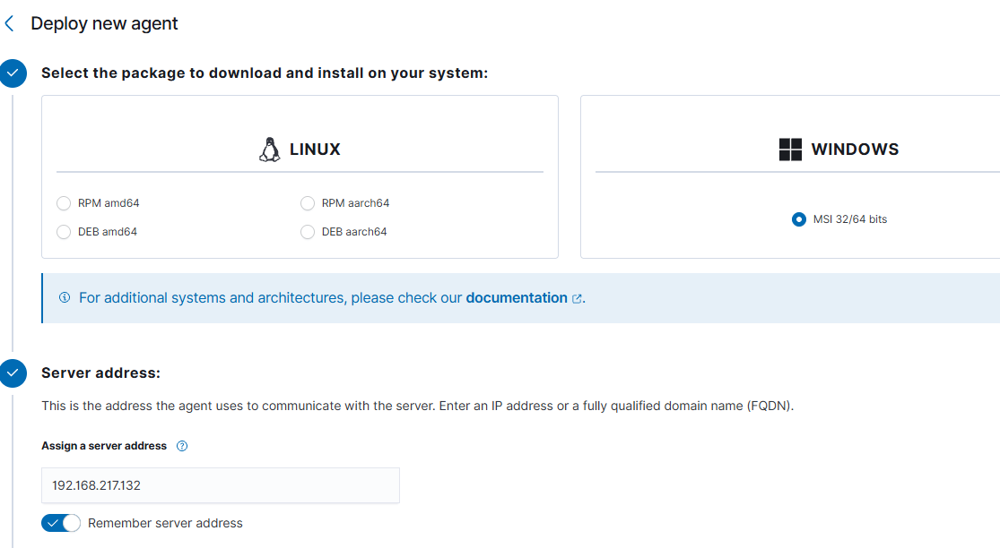

### 5.2 Install the Windows Agent

Run on the Windows VM in an elevated PowerShell session:

```powershell
Invoke-WebRequest -Uri https://packages.wazuh.com/4.x/windows/wazuh-agent-4.14.7-1.msi -OutFile $env:tmp\wazuh-agent
msiexec.exe /i $env:tmp\wazuh-agent /q WAZUH_MANAGER='<WAZUH_MANAGER_IP>'
```

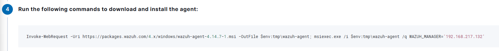

Start the agent service from **Services**, then confirm it shows as active in the dashboard:

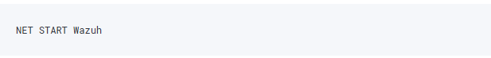
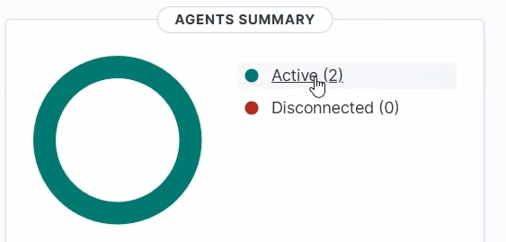

## 6. Installing and Configuring Sysmon

Sysmon extends Windows and Linux logging far beyond native OS auditing — process creation, network connections, file changes, and more — giving Wazuh much richer telemetry to alert on.

### 6.1 Sysmon on Windows

1. Download Sysmon and the [SwiftOnSecurity Sysmon config](https://github.com/SwiftOnSecurity/sysmon-config).
2. Install Sysmon with the community configuration:

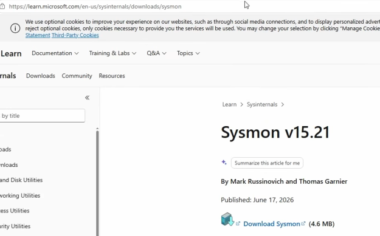
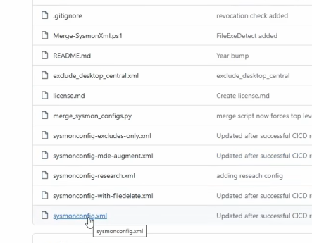

3. Confirm the Sysmon service is running:

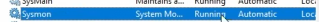

4. As Administrator, open `ossec.conf` in Notepad and add a new `<localfile>` block pointing at the Sysmon Operational log (path copied from Event Viewer):

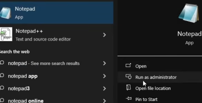
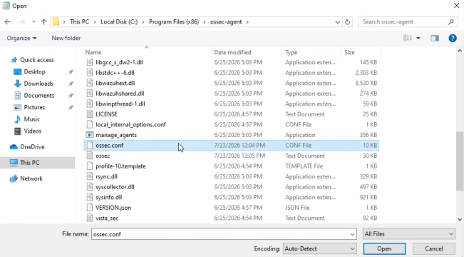
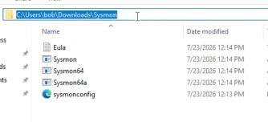
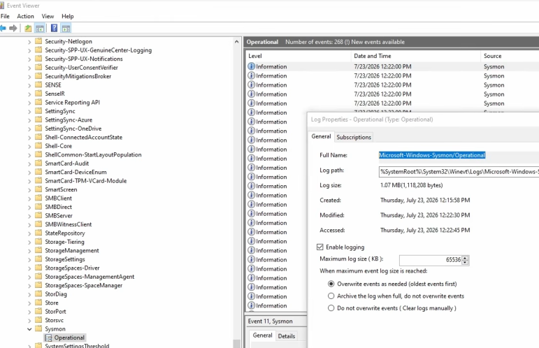
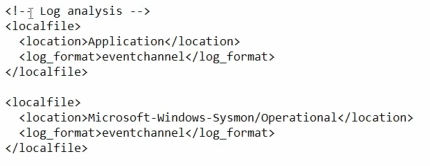

5. Restart the Wazuh agent service. Sysmon events now flow into the dashboard:

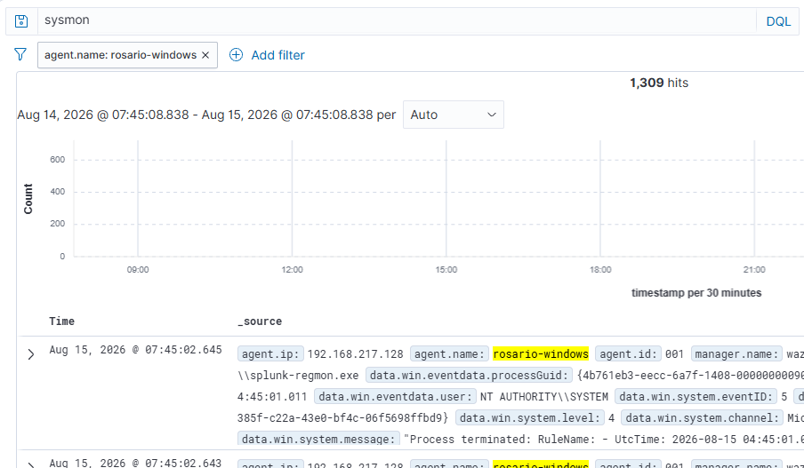

### 6.2 Sysmon for Linux

On the Ubuntu VM:

```bash
wget -q https://packages.microsoft.com/config/ubuntu/$(lsb_release -rs)/packages-microsoft-prod.deb -O packages-microsoft-prod.deb
sudo dpkg -i packages-microsoft-prod.deb
sudo apt-get update
sudo apt-get install sysmonforlinux
```

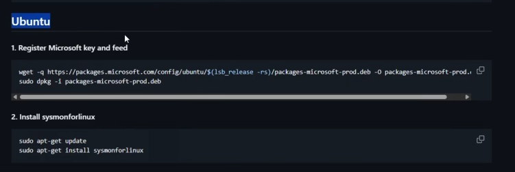
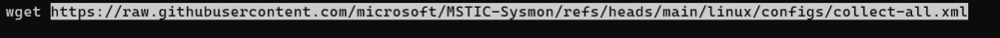

A community configuration (MSTIC-Sysmon `collect-all.xml`) is applied so Sysmon captures a broad event set:

```bash
wget https://raw.githubusercontent.com/microsoft/MSTIC-Sysmon/refs/heads/main/linux/configs/collect-all.xml
```

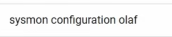
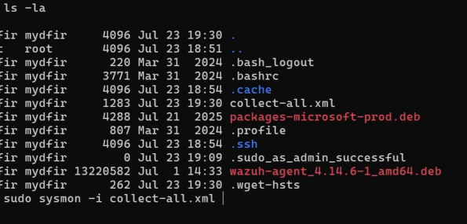

Sysmon logs are written under `/var/log`, and events start flowing into Wazuh for the Linux agent:

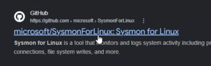

With both agents reporting Sysmon telemetry, the lab is ready to generate and detect real activity.

## 7. Generating and Detecting Activity

### 7.1 Windows: Account Creation and Deletion

From an elevated PowerShell session on the Windows VM:

```powershell
net localgroup administrators
net user student1 password /add
net localgroup administrators student1 /add
net localgroup administrators
net user student1 /delete
```

In the Wazuh dashboard, under **Discover**, filtering by `agent.name` for the Windows host and Windows Event ID `4726` confirms the account deletion was captured — along with the SID and which account performed the deletion:

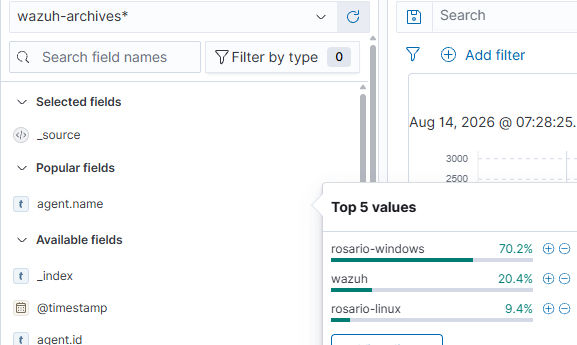

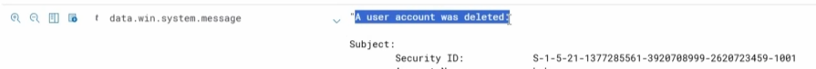
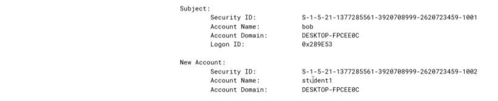

(Event ID `4732` — member added to a local group — can be checked the same way.)

### 7.2 Linux: Failed and Successful SSH Logins

From the Windows VM's PowerShell, SSH is attempted against the Ubuntu server — first with an invalid account, then with a valid one:

```bash
ssh fakeaccount@<UBUNTU_IP>   # fails, repeated 3 times
ssh rosario@<UBUNTU_IP>       # succeeds
```

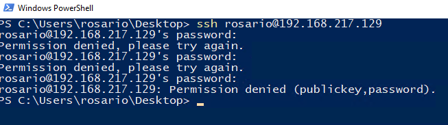
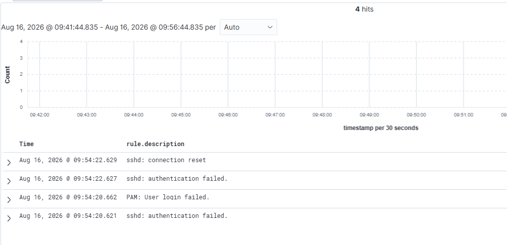

Filtering Discover by the Ubuntu agent over the last 15 minutes surfaces both the failed and successful login activity.

### 7.3 Linux: Simulated Data Access

A simple file-read action is simulated to generate additional telemetry — dumping the system account list to a file:

```bash
cat /etc/passwd > /tmp/loot.txt
cd /tmp
ls -la
```

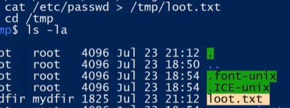


## 8. Building Security Dashboards

A custom dashboard is created with three panels to summarize activity at a glance.

### 8.1 Panel 1 — Failed Windows Logons (Metric)

A **Metric** visualization counts Windows Event ID `4625` (failed logon):

```
data.win.system.eventID: 4625
```

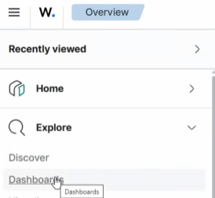
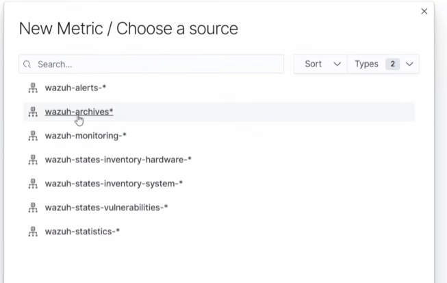

### 8.2 Panel 2 — Windows Account Changes Over Time (Line Chart)

A **Line** visualization tracks account-related Windows Event IDs over time:

```
data.win.system.eventID: ("4720" OR "4722" OR "4723" OR "4724" OR "4725" OR "4726" OR "4732" OR "4733" OR "4738")
```

Bucketed by a date histogram on the `timestamp` field:

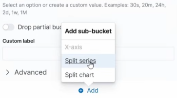
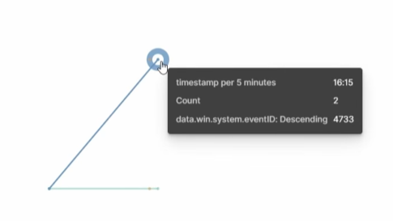

### 8.3 Panel 3 — Linux SSH Authentication Activity (Data Table)

A **Data table** visualization breaks down SSH activity against the Linux agent, bucketed by timestamp, source user (`data.srcuser`), destination, and source IP (`data.srcip`):

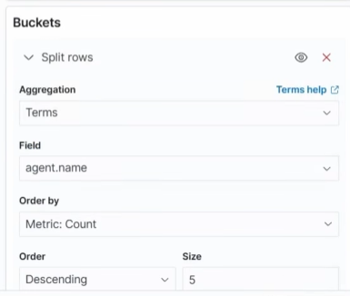
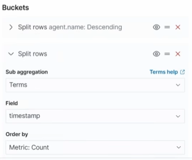
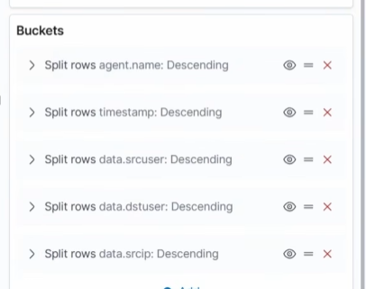

### 8.4 Final Dashboard

All three panels combined give a single-pane view of authentication health across both endpoints:

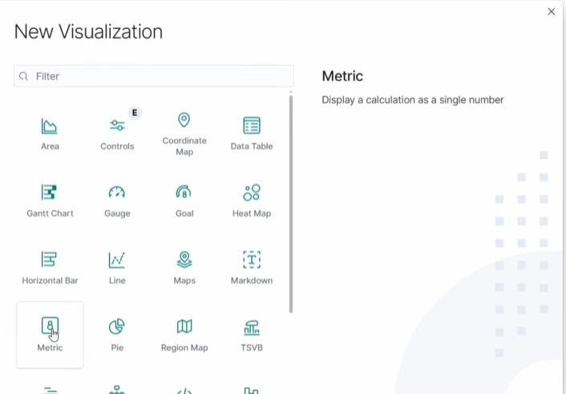
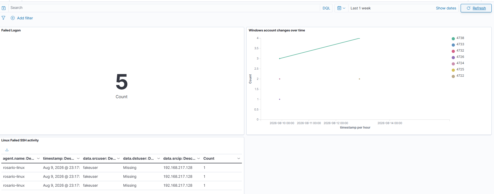

## 9. File Integrity Monitoring (FIM)

### 9.1 Windows FIM

A test folder and file are created to monitor:

```
C:\CompanyData\payroll.txt
```

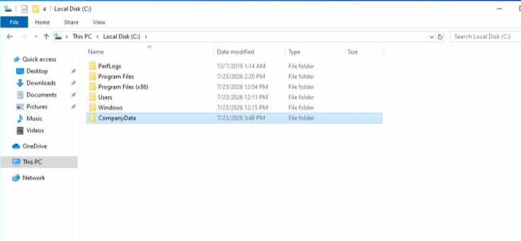
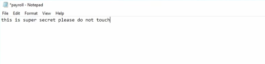

In `ossec.conf`, under the file integrity monitoring block, the folder is added as a monitored, real-time directory:

```xml
<directories realtime="yes">C:\CompanyData</directories>
```

After restarting the Wazuh agent, editing and then deleting `payroll.txt` produces integrity events in the dashboard:

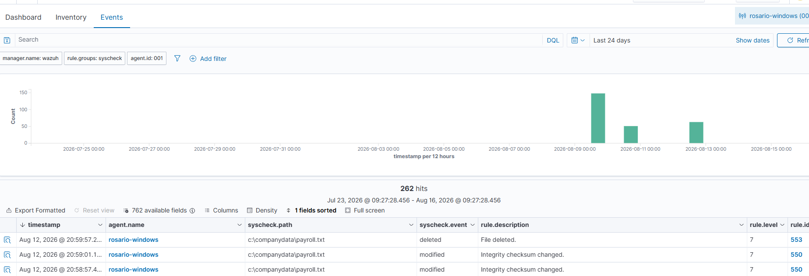

Reference: [Wazuh File Integrity Monitoring docs](https://documentation.wazuh.com/current/user-manual/capabilities/file-integrity/index.html)

### 9.2 Linux FIM

The same pattern is applied on Ubuntu:

```bash
sudo su -
mkdir /opt/company-data
echo "payroll data" > /opt/company-data/test.txt
sudo nano /var/ossec/etc/ossec.conf
```


Under the file integrity monitoring section:

```xml
<directories realtime="yes">/opt/company-data</directories>
```

```bash
sudo systemctl restart wazuh-agent.service
nano /opt/company-data/test.txt   # modify the file
rm /opt/company-data/test.txt     # then delete it
```

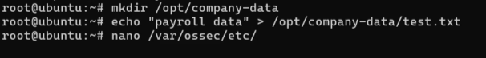
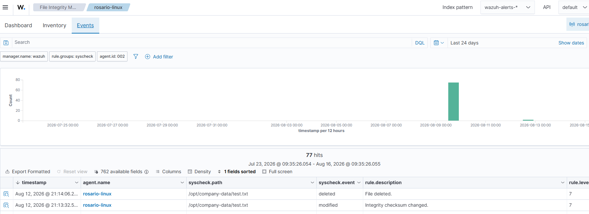

## 10. Writing Custom Detection Rules

### 10.1 Guest Account Enabled

Not every scenario is covered by Wazuh's default ruleset. A custom rule is added under **Server management > Rules** to flag when the built-in Guest account is enabled (Windows Event ID `4722` with `targetUserName: Guest`):

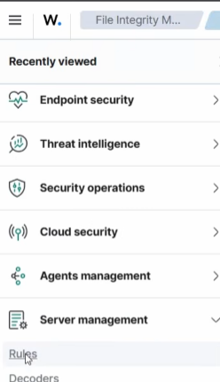

```xml
<group name="windows,windows_security,account_changed,adduser">
  <rule id="100101" level="10">
    <if_sid>60103</if_sid>
    <field name="win.system.eventID">4722</field>
    <field name="win.eventdata.targetUserName">Guest</field>
    <description>Windows Guest account has been enabled</description>
    <group>account_manipulation,windows,</group>
  </rule>
</group>
```

To trigger it, the Guest account is re-enabled from **Computer Management > Local Users and Groups**:

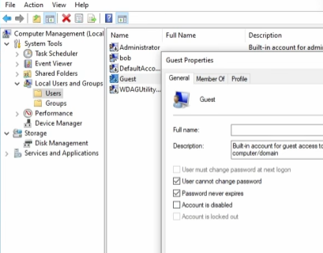

The rule fires and shows up in Discover with the matching `rule.description`:

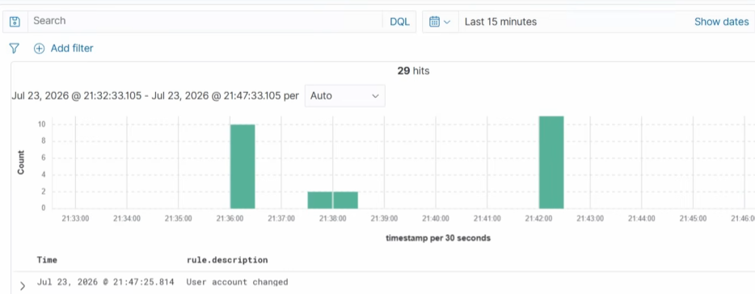

### 10.2 Multiple SSH Login Failures (Brute-Force Detection)

A second custom rule flags repeated SSH failures from the same source IP — 3 or more failures within a 120-second window:

```xml
<group name="local,syslog,sshd,authentication_failed,">
  <rule id="100102" level="10" frequency="3" timeframe="120">
    <if_matched_sid>5760</if_matched_sid>
    <same_source_ip />
    <description>Multiple SSH login failures observed from the same source IP</description>
    <mitre>
      <id>T1110</id>
    </mitre>
    <group>authentication_failed,ssh_bruteforce,credential_access,</group>
  </rule>
</group>
```

Failing an SSH login three times in a row from the same host confirms the rule triggers as expected:

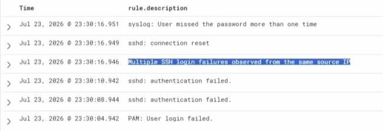

## 11. Automated Active Response

The brute-force rule above (`100102`) is wired to a Wazuh **Active Response**: when it fires, the offending source IP is automatically firewalled off the Ubuntu server.

### 11.1 Configure Active Response

On the Wazuh manager, edit `ossec.conf` and uncomment/add the active response block, referencing the custom rule ID:

```bash
sudo nano /var/ossec/etc/ossec.conf
```

```xml
<active-response>
  <disabled>no</disabled>
  <command>firewall-drop</command>
  <location>local</location>
  <rules_id>100102</rules_id>
</active-response>
```


```bash
sudo systemctl restart wazuh-manager.service
```

### 11.2 Verify the Block

Three failed SSH logins from the Windows VM trip rule `100102`, and Wazuh automatically drops the source IP via `iptables`. Follow-up `ping` requests to the Ubuntu server time out, confirming the block is active:


### 11.3 Restore Connectivity

To manually lift the block during testing:

```bash
sudo iptables -L -n --line-numbers
sudo iptables -D INPUT 1
sudo iptables -D FORWARD 1
```

## 12. Conclusion and Further Exploration

This lab built a working SOC pipeline end-to-end: telemetry collection from Windows and Linux endpoints via Sysmon, full event archiving, file integrity monitoring, custom detection rules, security dashboards, and automated response to a live brute-force attack. It demonstrates the core SOC analyst workflow — ingest, detect, investigate, and respond — in a fully self-contained home environment.


## 13. References

- [Wazuh Quickstart Guide](https://documentation.wazuh.com/current/quickstart.html)
- [Wazuh File Integrity Monitoring](https://documentation.wazuh.com/current/user-manual/capabilities/file-integrity/index.html)
- [SwiftOnSecurity Sysmon Config](https://github.com/SwiftOnSecurity/sysmon-config)
- [MSTIC-Sysmon (Linux configs)](https://github.com/microsoft/MSTIC-Sysmon)
- [MyDFIR — YouTube channel](https://www.youtube.com/@MyDFIR)
